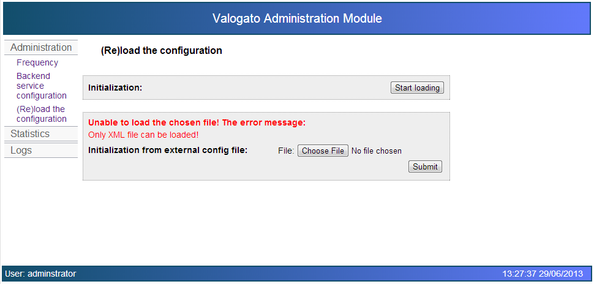

The backend service configuration can be (re)loaded on this page.

There are 2 possibilities how to load the XML:
  * using the default path (the ConfigurationBackendservice.xml file must be on the classpath)
  * using an external file

In case of error the description of the error can be seen on the page.

